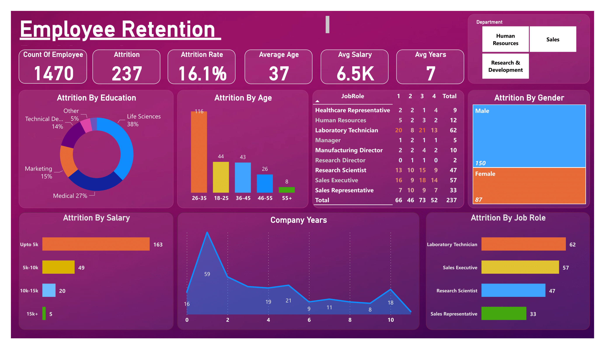

# Employee-Retention-Dashboard-On-PowerBI
_**Analyzing Employee Attrition: Power BI Insights**_

## Author
- [@saadharoon27](https://github.com/saadharoon27)

## Table of Contents
- [Project Scope](#project-scope)
- [Data Source](#data-source)
- [Column Overview](#column-overview)
- [Selection Of KPIs](#selection-of-kpis)
- [Quick Glance At The Dashboard](#quick-glance-at-the-dashboard)
- [Method](#method)
- [Steps in Data Cleaning](steps-in-data-cleaning)
- [Hypothesis And Observations](#hypothesis-and-observations)
- [Business Suggestions](#business-suggestions)

## Project Scope
The goal of this Power BI project is to analyse and identify the reasons for employee attrition within the organization. Employee attrition refers to the process of employees leaving the company voluntarily or involuntarily. By leveraging Power BI's data visualization capabilities, the project aims to provide valuable insights into the factors influencing attrition, enabling informed decision-making and retention strategies

## Data Source
- [HR Analytics Dataset](https://www.kaggle.com/datasets/saadharoon27/hr-analytics-dataset/data?select=HR_Analytics.csv)

## Column Overview
| **Column Name**     	   | **Description**     |
|-------------------	     |------------------	  |
| **EmpID**     	         | Employee ID |
| **Age**    	             | Age of the employee|
| **AgeGroup**             | Age group to which the employee belongs|
| **Attrition**     	     | Employee attrition status (whether the employee has left the organization or is still active) |
| **BusinessTravel**    	 | Frequency of business travel for the employee|
| **DailyRate**            | Daily rate of pay for the employee|
| **Department**           | Department in which the employee works             |
| **DistanceFromHome**     | Distance in miles from the employee's home to the workplace |
| **Education**            | Level of education attained by the employee        |
| **EducationField**       | Field of education of the employee                 |
| **EmployeeCount**        | Number of employees                                 |
| **EmployeeNumber**       | Unique identifier for each employee                 |
| **EnvironmentSatisfaction** | Employee's satisfaction level with the work environment |
| **Gender**               | Gender of the employee                              |
| **HourlyRate**           | Hourly rate of pay for the employee                 |
| **JobInvolvement**       | Employee's level of job involvement                 |
| **JobLevel**             | Level of the employee's job position                |
| **JobRole**              | Role of the employee within the organization       |
| **JobSatisfaction**      | Employee's satisfaction level with their job        |
| **MaritalStatus**        | Marital status of the employee                       |
| **MonthlyIncome**        | Monthly income of the employee                       |
| **SalarySlab**           | Categorization of monthly income into salary slabs  |
| **MonthlyRate**          | Monthly rate of pay for the employee                |
| **NumCompaniesWorked**   | Number of companies the employee has worked for in the past |
| **Over18**               | Whether the employee is over 18 years old           |
| **OverTime**             | Whether the employee works overtime or not         |
| **PercentSalaryHike**    | Percentage increase in salary for the employee      |
| **PerformanceRating**    | Performance rating of the employee                  |
| **RelationshipSatisfaction** | Employee's satisfaction level with work relationships |
| **StandardHours**        | Standard working hours for the employee             |
| **StockOptionLevel**     | Level of stock options granted to the employee      |
| **TotalWorkingYears**    | Total number of years the employee has worked       |
| **TrainingTimesLastYear** | Number of training sessions attended by the employee in the last year |
| **WorkLifeBalance**      | Employee's work-life balance satisfaction level    |
| **YearsAtCompany**       | Number of years the employee has worked at the current company |
| **YearsInCurrentRole**   | Number of years the employee has been in the current role |
| **YearsSinceLastPromotion** | Number of years since the employee's last promotion  |
| **YearsWithCurrManager** | Number of years the employee has been working with the current manager |

## Selection Of KPIs
- 1.	**Education Level:** Employees with higher education levels _(Life Sciences and Medical)_ may have different career aspirations, job preferences, and expectations, at the beginning of their career which can influence their decision to leave the company.
- 2.	**Age:** The age bracket with the highest attrition rate is _26-35 years_, or when employees were at the beginning of their careers. As the age increases attrition decreases.
- 3.	**Job Rating:** _Employee ratings_ may give insight into the likeliness of an employee who is going to leave the company in the near future.
- 4.	**Gender:** Which gender has a lower attrition rate.
- 5.	**Salary:** To see if the amount of salary does or does not impact the attrition rate, and in which _salary bracket_ it influences the most.
- 6.	**Job Role:** Which _job roles_ have the highest attrition rates, and are they more demanding jobs.
- 7.	**Company Years:** _Hypothesis:_ The number of years of experience with the company is inversely proportional to the likeliness of the employee leaving the firm.

## Quick Glance At The Dashboard

## Method
- Exploratory data analysis _(EDA)_

## Steps in Data Cleaning
- 1.	Removed the last row _‘YearsWithCurrManager’_ as it had missing data and was irrelevant to the current analysis.
- 2.	A total of _57 rows_ were removed due to _duplicate ‘EmpID’_
- 3.	Replaced all _‘TravelRarely’_ values to _‘Travel_Rarely’_ in **‘BusinessTravel’** column for consistency.
- 4.	Changed the column types of all column from _text_ to their _accurate datatype_.
- 5.	Created a custom column ‘_AttritionCount’_ to convert _‘Attrition’_ column into a _numeric column_ for analysis.

## Hypothesis And Observations

- 1.	**The highest attrition rate is during the first few years of job.**
  - **Observation:** The highest number of employees who left the company only worked for _less than 2 years_, **hence proving the hypothesis correct**.
- 2.	**Attrition is gender neutral.**
  - **Observation:** Attrition is not gender neutral as there is almost _double the number of male employees who left the job (150), compared to female (87)_. **Proving the hypothesis wrong**.
- 3.	**Job Payee has a strong influence in employee attrition.**
  - **Observation:** Jobs with the lowest pay, i.e., _under 5K_, sees the _highest attrition rates (163)_. **Proving the hypothesis correct**.

## Business Suggestions
- 1.	To decrease attrition within two years, the company should focus on a strong onboarding process, career development opportunities, recognition programs, work-life balance, and feedback. These strategies create a positive work environment, boost employee satisfaction, and foster long-term commitment to the company.

- 2.	To decrease the attrition rate of employees earning less than 15K, the company should implement targeted strategies. Offer skill development opportunities and clear career paths to encourage growth within the organization. Recognize and appreciate their efforts through regular feedback and acknowledgment programs. Organize team-building events and create a positive work environment. By adopting these measures, the company can create a supportive workplace, and reduce attrition among lower-paid employees.

- 3.	To reduce attrition in complex job roles (lab technicians, research scientists, sales executives), the company should focus on building career paths, learning opportunities, competitive compensation, work-life balance, recognition, engagement, and communication. Create a supportive atmosphere to improve satisfaction and retention.
